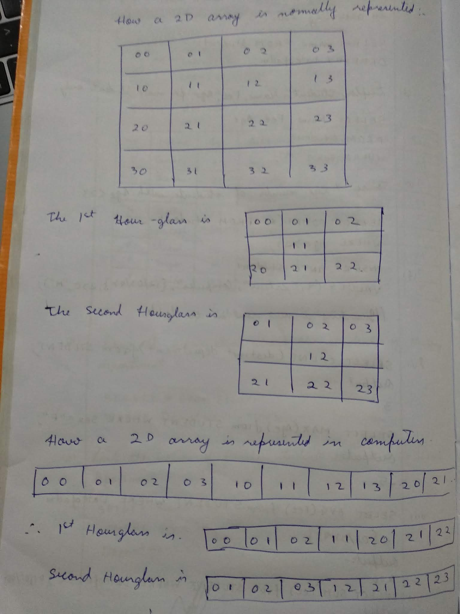

## Link to the challenge

[2D Array - DS | HackerRank](https://www.hackerrank.com/challenges/2d-array/problem?h_l=interview&playlist_slugs%5B%5D=interview-preparation-kit&playlist_slugs%5B%5D=arrays)

## Related Resources

* [Initialization using Min value instead of 0](https://www.geeksforgeeks.org/int_max-int_min-cc-applications/)

* Explanation of the question

**Given a 2d array**, we need to **loop through the whole array** and **add certain elements** (in this case the elements to be added are in hourglass pattern). Finally **find the maximum of those sums** and print it.

* Picture representation

The following picture represents how a 2D array is structured in computer and how hourglass pattern can be obtained.

