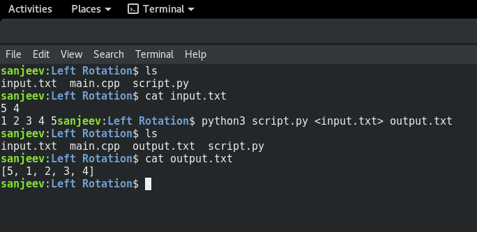

## Transcripts of the session conducted by @sanjeev.abnd

* __What is Competitive Programming ?__
In simple words "Solving well-defined problems by writing computer programs under specified limits"

* Things that you need to learn to master Competitive Programming from Scratch are :
    1. A Programming Language (C/C++ preferred).
    2. Space and Time Complexity (Most Important).
    3. Data Structures and Algorithms.

* I would suggest everyone to learn Data Structures and Algorithms in C/C++ as you will implement them from scratch in it. Thats the way to learn.

* Now coming point, why I said Space and Time complexity is most important
    1. The Algorithm that you build to solve the given problem , you must be able to analyse it.
    2. What I mean is that, you must be able to compare its runtime at higher order of inputs.
    3. You can guess the complexity of algorithm that will Solve the problem beforehand looking at the constraints.

* In some contests, there is a penalty for wrong answers. so, how do we check them on local machine ? also, the inputs are very large. Here is how :
    
    1. Download the input as txt file and place in same directory as your program.
    2. Run your program from terminal using command
    ```python3 program name <input file name> output file name```
    or
    ```java program name <input file name> output file name```
    3. You program output will be saved in a text file.

### Problem Solving Section
* Left Rotation
    1. The same problem can be solved in Python/Java using slicing:
    ```
        n, d = map(int, input().split())
        arr = list(map(int, input().split()))
        arr2 = [0 for _ in range(n)]
        arr2[n-d:n] = arr[:d]
        arr2[:n-d] = arr[d:]
        print(arr2)
    ```
    2. Left rotation problem can be solved in O(n) time.
    ```
        int n = /* take input */
        int d = /* take input */
        int [] a = /* input array */
        int [] b = /* rotated array initialize of same size as a */
        for ( int i = 0; i < n; i++) {
            b[i+n-d] = a[i];
        }
        /* print b */
    ```
* Problem of Sparse Array
    1. Approach 1: Complexity = O(n*m)
    ```
        static int[]matchingStrings(String[]strings,String[] queries){

        int[]answer=new int[queries.length];

        for(int i=0;i<queries.length;i++){
            int count=0;
            for(String ele:strings){
                if(ele.equals(queries[i]))
                    count++;
            }
            answer[i]=count;
        }

        return answer;
        }
    ```
    2. Approach 2: Complexity = O(n+m)
    ```
        static int[] matchingStrings(String[] strings, String[] queries){
        HashMap<String, Integer> frequencies = new HashMap();

        int[] answer = new int[queries.length];

        for(String str:strings){
            if(frequencies.containsKey(str)){
                frequencies.put(str, frequencies.get(str) + 1)
            }
            else{
                frequencies.put(str, 1);
            }
        }

        for(int i=0; i<queries.length; i++){
            if(frequencies.containsKey(query[i])){
                answer[i] = frequencies.get(queries[i]);
            }
            else{
                answer[i] = 0;
            }
        }

        return answer;
        }
    ```
* Print the nth node from the last.
    1. Can be solved by using two-pointer method:
    ```
        static int getNode(SinglyLinkedListNode head, int positionFromTail) {
        int a = 0;
        SinglyLinkedListNode c = head, r = head;
        while(c != null){
            c = c.next;
            if(a++ > positionFromTail)
                r = r.next;
        }
        return r.data;
        }
    ```

